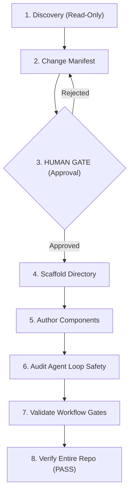

# Design Ecosystem Workflow

Flagship 5-phase gated workflow for planning, scaffolding, authoring, and validating a complete agentic configuration ecosystem (`context/`, `skills/`, `agents/`, `workflows/`).

## Purpose

Enforces the canonical 5-phase protocol (Discovery, Manifest, Gate, Implementation, Review) when creating new agent ecosystems. Ensures that no directories are created, no files are modified, and no configurations are deployed without explicit human-in-the-loop (HITL) approval, and that all produced artifacts satisfy the repository's strict quality and loop safety gates.

## Actors

* **cs-agentic-system-architect** (Primary Executor): Runs the discovery process, proposes the Change Manifest, executes scaffolding, authors components, and runs audits.
* **human-reviewer** (Gatekeeper): Holds the keys to the Human Gate, reviewing and approving the Change Manifest before execution.
* **cs-agent-designer** (Specialist): Assists in planning multi-agent roles and tool distributions.
* **cs-prompt-engineer** (Specialist): Assists in drafting system prompts and few-shot examples for the new agents.
* **cs-agent-security-auditor** (Auditor): Performs pre-merge security scans on scripts and configurations.

## Gate Map



## Rollback Plan

* **If Scaffolding Fails:** Delete the created folders (`context/`, `skills/`, `agents/`, `workflows/`) matching the directories declared in the approved Change Manifest.
* **If Implementation Fails:** Discard all changes and restore the previous git repository state using:
  ```bash
  git reset --hard HEAD
  git clean -fd
  ```

## Escalation

* **Escalation Contact:** `system-architect-oncall`
* **Escalation Trigger:** Human Gate rejection, failed automated safety audits (score < 90), or validation errors during repository checks.

---

## Workflow Schema (JSON Definition)

The following JSON block defines the gated steps, safety parameters, and error handlers checked by the repository validator:

```json
{
  "name": "design-ecosystem",
  "version": "0.1.0",
  "steps": [
    {
      "id": "discovery",
      "type": "action",
      "description": "DISCOVERY (read-only): Map system goals, constraints, tool requirements, and scope boundaries. No code modification allowed.",
      "irreversible": false,
      "requires_approval": false,
      "rollback": null,
      "on_failure": "retry",
      "max_retries": 2,
      "depends_on": []
    },
    {
      "id": "manifest",
      "type": "action",
      "description": "MANIFEST: Generate a Change Manifest detailing the new skills to create, agents to configure, workflows to write, files to modify, security risks, and rollback plan.",
      "irreversible": false,
      "requires_approval": false,
      "rollback": null,
      "on_failure": "retry",
      "max_retries": 2,
      "depends_on": ["discovery"]
    },
    {
      "id": "human-approval",
      "type": "gate",
      "description": "HUMAN GATE: Hard stop. Present the Change Manifest to the human reviewer for review, edit, or approval. No code writes can occur before approval.",
      "irreversible": false,
      "requires_approval": true,
      "rollback": null,
      "on_failure": "escalate",
      "max_retries": 0,
      "depends_on": ["manifest"]
    },
    {
      "id": "scaffold",
      "type": "action",
      "description": "SCAFFOLD: Run ecosystem_scaffolder.py to create the directory structure (context/, skills/, agents/, workflows/) for the approved manifest.",
      "irreversible": true,
      "requires_approval": false,
      "rollback": "Remove the newly scaffolded directory paths listed in the approved manifest.",
      "on_failure": "escalate",
      "max_retries": 0,
      "depends_on": ["human-approval"]
    },
    {
      "id": "author-components",
      "type": "action",
      "description": "AUTHOR: Write the context packs, skills (SKILL.md, scripts), agent configurations (cs-*.md), and workflows (.md) matching the approved blueprints.",
      "irreversible": true,
      "requires_approval": false,
      "rollback": "Delete newly created config files and restore modified files using git checkout.",
      "on_failure": "escalate",
      "max_retries": 0,
      "depends_on": ["scaffold"]
    },
    {
      "id": "audit-safety",
      "type": "action",
      "description": "AUDIT: Run loop_auditor.py on all new agent files and check that they score >= 90 (HARDENED).",
      "irreversible": false,
      "requires_approval": false,
      "rollback": null,
      "on_failure": "retry",
      "max_retries": 3,
      "depends_on": ["author-components"]
    },
    {
      "id": "validate-workflow",
      "type": "action",
      "description": "VALIDATE: Run hitl_gate_validator.py on the new workflow file(s) and ensure they return PASS.",
      "irreversible": false,
      "requires_approval": false,
      "rollback": null,
      "on_failure": "retry",
      "max_retries": 2,
      "depends_on": ["audit-safety"]
    },
    {
      "id": "verify-repo",
      "type": "check",
      "description": "VERIFY: Run the unified validate_repo.py script over the entire workspace. Ensure overall verification is PASS.",
      "irreversible": false,
      "requires_approval": false,
      "rollback": null,
      "on_failure": "escalate",
      "max_retries": 0,
      "depends_on": ["validate-workflow"]
    }
  ],
  "escalation": {
    "contact": "system-architect-oncall",
    "trigger": "Human Gate rejection, safety audit score failure, or repository verification failures."
  }
}
```
