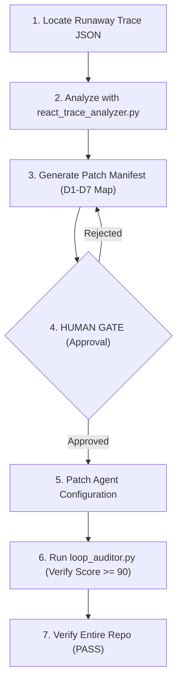

# Diagnose Runaway Workflow

Gated process workflow for analyzing a runaway agent trace JSON, detecting reasoning loop pathologies (D1-D7), proposing mitigations, and patching the agent configuration.

## Purpose

Establishes a systematic debugging and patching pipeline for agents that exhibit runaway behaviors (infinite loops, oscillations, budget overruns, or contract violations). Enforces analysis and human-in-the-loop validation before applying code patches to agent specs.

## Actors

* **cs-agentic-system-architect** (Primary Executor): Collects the execution trace logs, analyzes them for D1-D7 pathologies, drafts the remediation manifest, and patches the agent config file.
* **human-reviewer** (Gatekeeper): Holds the keys to the Human Gate, reviewing and approving the patch details before they are written.
* **cs-agent-designer** (Specialist): Collaborates to verify if agent boundaries or tool schemas require adjustment.

## Gate Map



## Rollback Plan

* **If Patching Fails:** Discard the changes and restore the previous git state of the modified agent configuration using:
  ```bash
  git checkout -- <agent_file_path>
  ```

## Escalation

* **Escalation Contact:** `system-architect-oncall`
* **Escalation Trigger:** Human Gate rejection, failed validation, or unrecoverable error during patching cycles.

---

## Workflow Schema (JSON Definition)

The following JSON block defines the gated steps, safety parameters, and error handlers checked by the repository validator:

```json
{
  "name": "diagnose-runaway",
  "version": "0.1.0",
  "steps": [
    {
      "id": "discovery",
      "type": "action",
      "description": "DISCOVERY (read-only): Locate and load the captured agent ReAct execution trace JSON file. No changes allowed.",
      "irreversible": false,
      "requires_approval": false,
      "rollback": null,
      "on_failure": "retry",
      "max_retries": 2,
      "depends_on": []
    },
    {
      "id": "analyze-trace",
      "type": "action",
      "description": "ANALYZE: Run react_trace_analyzer.py on the trace file to identify runaway patterns (D1-D7) and compute health scores.",
      "irreversible": false,
      "requires_approval": false,
      "rollback": null,
      "on_failure": "retry",
      "max_retries": 2,
      "depends_on": ["discovery"]
    },
    {
      "id": "manifest",
      "type": "action",
      "description": "MANIFEST: Produce a Change Manifest mapping the trace analysis findings to specific loop engineering mitigations, detailing the file changes, security risks, and rollback plan.",
      "irreversible": false,
      "requires_approval": false,
      "rollback": null,
      "on_failure": "retry",
      "max_retries": 2,
      "depends_on": ["analyze-trace"]
    },
    {
      "id": "human-approval",
      "type": "gate",
      "description": "HUMAN GATE: Hard stop. Present the Change Manifest and trace findings to the human reviewer. No file modifications can be performed before approval.",
      "irreversible": false,
      "requires_approval": true,
      "rollback": null,
      "on_failure": "escalate",
      "max_retries": 0,
      "depends_on": ["manifest"]
    },
    {
      "id": "patch-config",
      "type": "action",
      "description": "PATCH: Apply the loop engineering mitigations (adding exit conditions, dedup checks, or counters) to the agent markdown file.",
      "irreversible": true,
      "requires_approval": false,
      "rollback": "Revert the agent configuration file using: git checkout -- <file_path>",
      "on_failure": "escalate",
      "max_retries": 0,
      "depends_on": ["human-approval"]
    },
    {
      "id": "audit-patch",
      "type": "action",
      "description": "AUDIT: Run loop_auditor.py on the patched agent configuration file to ensure the new controls raise its score to >= 90.",
      "irreversible": false,
      "requires_approval": false,
      "rollback": null,
      "on_failure": "retry",
      "max_retries": 3,
      "depends_on": ["patch-config"]
    },
    {
      "id": "verify-repo",
      "type": "check",
      "description": "VERIFY: Run the unified validate_repo.py script to ensure the entire repository validation remains PASS.",
      "irreversible": false,
      "requires_approval": false,
      "rollback": null,
      "on_failure": "escalate",
      "max_retries": 0,
      "depends_on": ["audit-patch"]
    }
  ],
  "escalation": {
    "contact": "system-architect-oncall",
    "trigger": "Human Gate rejection, validation failure, or unrecoverable error during patching cycles."
  }
}
```
