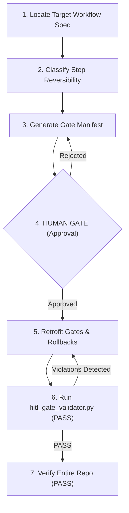

# Gate Multi-Agent Workflow

Gated process workflow for retrofitting an ungated workflow config: classifying steps by reversibility, inserting human approval gates before irreversible operations, and verifying compliance.

## Purpose

Enforces the project's safety standard R1-R6 on existing workflows. Prevents any multi-agent sequence from executing state-mutating or costly actions (deletes, deploys, publications) without a preceding human gate and a valid rollback plan.

## Actors

* **cs-agentic-system-architect** (Primary Executor): Scans the target workflow, classifies the reversibility of its steps, proposes the gate layout manifest, retrofits the files, and runs validation checks.
* **human-reviewer** (Gatekeeper): Holds the keys to the Human Gate, reviewing and approving the gate placement and rollback plans.
* **cs-agent-designer** (Specialist): Collaborates to verify step dependencies and resolve cyclic graphs.

## Gate Map



## Rollback Plan

* **If Retrofitting Fails:** Discard the edits and restore the target workflow configuration using:
  ```bash
  git checkout -- <workflow_file_path>
  ```

## Escalation

* **Escalation Contact:** `system-architect-oncall`
* **Escalation Trigger:** Human Gate rejection, failed validation checks, or unrecoverable cyclic dependency errors.

---

## Workflow Schema (JSON Definition)

The following JSON block defines the gated steps, safety parameters, and error handlers checked by the repository validator:

```json
{
  "name": "gate-multiagent-workflow",
  "version": "0.1.0",
  "steps": [
    {
      "id": "discovery",
      "type": "action",
      "description": "DISCOVERY (read-only): Locate and load the target ungated multi-agent workflow file. No changes allowed.",
      "irreversible": false,
      "requires_approval": false,
      "rollback": null,
      "on_failure": "retry",
      "max_retries": 2,
      "depends_on": []
    },
    {
      "id": "classify-steps",
      "type": "action",
      "description": "CLASSIFY: Review each step in the workflow to classify its state change impact: REVERSIBLE, COSTLY, or IRREVERSIBLE.",
      "irreversible": false,
      "requires_approval": false,
      "rollback": null,
      "on_failure": "retry",
      "max_retries": 2,
      "depends_on": ["discovery"]
    },
    {
      "id": "manifest",
      "type": "action",
      "description": "MANIFEST: Produce a Change Manifest mapping out the proposed gate placements (inserting gates before irreversible steps), defining rollbacks, and specifying the top-level escalation object.",
      "irreversible": false,
      "requires_approval": false,
      "rollback": null,
      "on_failure": "retry",
      "max_retries": 2,
      "depends_on": ["classify-steps"]
    },
    {
      "id": "human-approval",
      "type": "gate",
      "description": "HUMAN GATE: Hard stop. Present the Change Manifest to the human reviewer. No edits can be performed on the workflow config before approval.",
      "irreversible": false,
      "requires_approval": true,
      "rollback": null,
      "on_failure": "escalate",
      "max_retries": 0,
      "depends_on": ["manifest"]
    },
    {
      "id": "retrofit-gates",
      "type": "action",
      "description": "RETROFIT: Apply the approved changes (inserting type: gate steps and setting requires_approval: true) to the target workflow file.",
      "irreversible": true,
      "requires_approval": false,
      "rollback": "Revert the workflow configuration file using: git checkout -- <file_path>",
      "on_failure": "escalate",
      "max_retries": 0,
      "depends_on": ["human-approval"]
    },
    {
      "id": "validate-gates",
      "type": "action",
      "description": "VALIDATE: Run hitl_gate_validator.py on the retrofitted workflow file to ensure it passes all rules R1-R6 with zero CRITICAL/HIGH violations.",
      "irreversible": false,
      "requires_approval": false,
      "rollback": null,
      "on_failure": "retry",
      "max_retries": 3,
      "depends_on": ["retrofit-gates"]
    },
    {
      "id": "verify-repo",
      "type": "check",
      "description": "VERIFY: Run the unified validate_repo.py script to ensure the entire repository validation remains PASS.",
      "irreversible": false,
      "requires_approval": false,
      "rollback": null,
      "on_failure": "escalate",
      "max_retries": 0,
      "depends_on": ["validate-gates"]
    }
  ],
  "escalation": {
    "contact": "system-architect-oncall",
    "trigger": "Human Gate rejection, validation failure, or unrecoverable dependency errors."
  }
}
```
