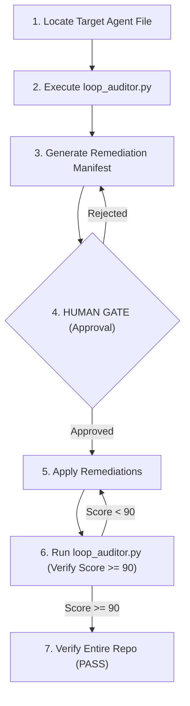

# Harden Agent Workflow

Gated process workflow for auditing an existing agent config file, proposing remediations for failed safety checks, and hardening it to `>= 90 HARDENED` grade.

## Purpose

Enforces a rigorous audit-and-remediate cycle when editing existing agent specifications. Prevents deploying sub-HARDENED or un-engineered configurations, ensuring all loops, boundaries, and human gates are validated before execution.

## Actors

* **cs-agentic-system-architect** (Primary Executor): Reviews the agent specification, executes the loop safety audits, proposes the Change Manifest, and applies the approved remediations.
* **human-reviewer** (Gatekeeper): Holds the keys to the Human Gate, reviewing and approving the Change Manifest (remediation diff) before modification.
* **cs-prompt-engineer** (Specialist): Collaborates to design appropriate few-shot boundaries or safety thresholds.

## Gate Map



## Rollback Plan

* **If Remediation Fails:** Restore the previous git state of the modified agent configuration using:
  ```bash
  git checkout -- <agent_file_path>
  ```

## Escalation

* **Escalation Contact:** `system-architect-oncall`
* **Escalation Trigger:** Human Gate rejection, failed validation, or unrecoverable error during remediation cycles.

---

## Workflow Schema (JSON Definition)

The following JSON block defines the gated steps, safety parameters, and error handlers checked by the repository validator:

```json
{
  "name": "harden-agent",
  "version": "0.1.0",
  "steps": [
    {
      "id": "discovery",
      "type": "action",
      "description": "DISCOVERY (read-only): Locate the target agent markdown configuration file and read its contents. No modifications allowed.",
      "irreversible": false,
      "requires_approval": false,
      "rollback": null,
      "on_failure": "retry",
      "max_retries": 2,
      "depends_on": []
    },
    {
      "id": "audit",
      "type": "action",
      "description": "AUDIT: Run loop_auditor.py on the agent file to output the score and identify failed checks.",
      "irreversible": false,
      "requires_approval": false,
      "rollback": null,
      "on_failure": "retry",
      "max_retries": 2,
      "depends_on": ["discovery"]
    },
    {
      "id": "manifest",
      "type": "action",
      "description": "MANIFEST: Produce a Change Manifest mapping the failed checks to required remediations (adding max_iterations, no_progress, oscillation, or budget limits), identifying security risks, and outlining a rollback plan.",
      "irreversible": false,
      "requires_approval": false,
      "rollback": null,
      "on_failure": "retry",
      "max_retries": 2,
      "depends_on": ["audit"]
    },
    {
      "id": "human-approval",
      "type": "gate",
      "description": "HUMAN GATE: Hard stop. Present the Change Manifest to the human reviewer for approval. No changes can be written to the agent config before approval.",
      "irreversible": false,
      "requires_approval": true,
      "rollback": null,
      "on_failure": "escalate",
      "max_retries": 0,
      "depends_on": ["manifest"]
    },
    {
      "id": "remediate",
      "type": "action",
      "description": "REMEDIATE: Apply the approved modifications (adding missing loops, counters, boundaries, or contracts) to the agent markdown file.",
      "irreversible": true,
      "requires_approval": false,
      "rollback": "Revert the agent configuration file back to the git snapshot using: git checkout -- <file_path>",
      "on_failure": "escalate",
      "max_retries": 0,
      "depends_on": ["human-approval"]
    },
    {
      "id": "re-audit",
      "type": "action",
      "description": "RE-AUDIT: Run loop_auditor.py on the remediated agent file to verify it scores >= 90 (HARDENED).",
      "irreversible": false,
      "requires_approval": false,
      "rollback": null,
      "on_failure": "retry",
      "max_retries": 3,
      "depends_on": ["remediate"]
    },
    {
      "id": "verify-repo",
      "type": "check",
      "description": "VERIFY: Run the unified validate_repo.py script to ensure the entire repository validation remains PASS.",
      "irreversible": false,
      "requires_approval": false,
      "rollback": null,
      "on_failure": "escalate",
      "max_retries": 0,
      "depends_on": ["re-audit"]
    }
  ],
  "escalation": {
    "contact": "system-architect-oncall",
    "trigger": "Human Gate rejection, validation failure, or unrecoverable error during remediation cycles."
  }
}
```
