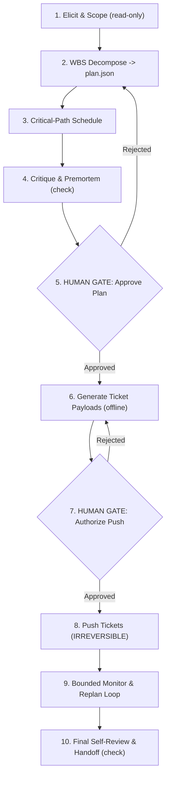

# Project Planning Pipeline Workflow

Gated end-to-end orchestration that takes a raw project idea from elicitation through work
breakdown, scheduling, risk critique, human approval, real ticket creation, and a bounded
monitor/replan loop. It encodes the full A-F planning capability set (elicitation ->
decomposition -> scheduling -> critique -> ticket export/push -> baseline tracking &
replanning) as one acyclic, HITL-gated sequence in which the only irreversible action -
creating tickets in an external tracker - is protected by two human gates and a documented
rollback.

## Purpose

Enforces the canonical 5-phase protocol (Discovery, Manifest, Gate, Implementation, Review)
for project planning so that no external side effect occurs before a human approves the plan.
All discovery, decomposition, scheduling, and critique run read-only or against local
artifacts; the plan, schedule, and risk register must clear a HUMAN GATE before any ticket
payload is pushed; and the single irreversible operation (pushing tickets to Jira/Asana/
Trello) sits behind a dedicated second gate with an explicit, idempotency-anchored rollback.
Ongoing execution is governed by a bounded monitoring loop whose exit conditions are drawn
from the six-type taxonomy, never an open-ended agent.

## Actors

* **cs-agentic-system-architect** (Primary Executor): Runs elicitation and scoping, decomposes
  the idea into a work breakdown, schedules the DAG, drives the critique and premortem,
  generates ticket payloads, pushes approved tickets, and operates the bounded monitor/replan
  loop.
* **human-reviewer** (Gatekeeper): Holds the keys to both HUMAN GATES - approving the plan,
  schedule, and risk register before any external side effect, and separately authorizing the
  irreversible ticket push - and adjudicates any escalation.
* **cs-agent-designer** (Specialist): Assists in shaping the work breakdown structure and
  dependency graph so the schedule is well-formed and acyclic.
* **cs-prompt-engineer** (Specialist): Assists with the sequential-elicitation, stakeholder-
  inference, and blind-spot-audit prompting during discovery.

## Gate Map



## Rollback Plan

* **Reversible steps (1-4, 6):** Discovery is read-only; decomposition, scheduling, and payload
  generation write only local artifacts (`plan.json`, the dated schedule, the risk register,
  and offline ticket-payload files). Discard them with:
  ```bash
  git checkout -- plan.json schedule.json risk-register.md ticket-payloads/
  ```
* **Irreversible step (8, push-tickets):** Every created issue is stamped with the run's
  idempotency marker (a unique correlation id embedded in each ticket body/label). To roll
  back, enumerate issues carrying that marker and archive or delete them through the tracker's
  own API before any human depends on them:
  ```bash
  # pseudo-remediation, tool-specific:
  # for each issue where label == <run-idempotency-marker>: tracker.issues.archive(issue.id)
  ```
  The idempotency marker also makes a re-run safe: a second push updates the marked issues
  instead of duplicating them.

## Escalation

* **Escalation Contact:** `project-planning-oncall`
* **Escalation Trigger:** Human Gate rejection that cannot be resolved by revision, failure of
  the irreversible ticket push, or a monitoring-loop deadline breach beyond the approved
  tolerance.

---

## Workflow Schema (JSON Definition)

The following JSON block defines the gated steps, safety parameters, and error handlers checked
by the repository validator (`hitl_gate_validator.py` reads the FIRST fenced json block):

```json
{
  "name": "project-planning-pipeline",
  "version": "1.0.0",
  "steps": [
    {
      "id": "elicit-and-scope",
      "type": "action",
      "description": "DISCOVERY (read-only): Run sequential-elicitation to draw out the raw project idea, stakeholder-inference to map affected parties, and a blind-spot-audit to surface unstated assumptions and missing requirements. Produces a scoped problem statement only; makes no external changes and writes no plan artifacts yet.",
      "irreversible": false,
      "requires_approval": false,
      "rollback": null,
      "on_failure": "retry",
      "max_retries": 2,
      "depends_on": []
    },
    {
      "id": "decompose",
      "type": "action",
      "description": "DECOMPOSE: Apply wbs-decomposition to the scoped problem statement, breaking it into a work breakdown structure of tasks with dependencies, and persist it locally as plan.json. Reversible: writes only a local artifact.",
      "irreversible": false,
      "requires_approval": false,
      "rollback": null,
      "on_failure": "retry",
      "max_retries": 2,
      "depends_on": ["elicit-and-scope"]
    },
    {
      "id": "schedule",
      "type": "action",
      "description": "SCHEDULE: Run the critical-path-scheduler over the plan.json DAG to compute earliest/latest starts, the critical path, and a dated schedule. Reversible: writes only a local dated-schedule artifact.",
      "irreversible": false,
      "requires_approval": false,
      "rollback": null,
      "on_failure": "retry",
      "max_retries": 2,
      "depends_on": ["decompose"]
    },
    {
      "id": "critique-and-premortem",
      "type": "check",
      "description": "CRITIQUE: Run plan-critique against the draft plan and schedule to flag weak estimates, unstated dependencies, and overload, and plan-premortem to imagine failure modes and produce a risk register. Read-only analysis over local artifacts; makes no external changes.",
      "irreversible": false,
      "requires_approval": false,
      "rollback": null,
      "on_failure": "escalate",
      "max_retries": 0,
      "depends_on": ["schedule"]
    },
    {
      "id": "plan-approval-gate",
      "type": "gate",
      "description": "HUMAN GATE (hard stop): Present the plan, dated schedule, and risk register to the human reviewer for approval BEFORE any external side effect. No ticket payloads may be generated or pushed until this gate is approved. Rejection routes back to decomposition for revision.",
      "irreversible": false,
      "requires_approval": true,
      "rollback": null,
      "on_failure": "escalate",
      "max_retries": 0,
      "depends_on": ["critique-and-premortem"]
    },
    {
      "id": "generate-ticket-payloads",
      "type": "action",
      "description": "EXPORT (offline): Run plan-ticket-export to transform the approved plan and schedule into tracker-ready ticket payloads (title, body, dependencies, assignees, and a unique run idempotency marker per ticket), writing them to local payload files. Reversible: generates files only; makes no calls to any external tracker.",
      "irreversible": false,
      "requires_approval": false,
      "rollback": null,
      "on_failure": "retry",
      "max_retries": 2,
      "depends_on": ["plan-approval-gate"]
    },
    {
      "id": "push-approval-gate",
      "type": "gate",
      "description": "HUMAN GATE (hard stop, defense-in-depth): Present the exact offline ticket payloads and the target tracker/project to the human reviewer for explicit authorization to create real issues. This second gate guards the single irreversible action. Rejection routes back to payload generation for correction.",
      "irreversible": false,
      "requires_approval": true,
      "rollback": null,
      "on_failure": "escalate",
      "max_retries": 0,
      "depends_on": ["generate-ticket-payloads"]
    },
    {
      "id": "push-tickets",
      "type": "action",
      "description": "PUSH (IRREVERSIBLE): Create the real Jira/Asana/Trello tickets from the approved payloads via the tracker API. This is the only irreversible step in the pipeline; it is protected by both plan-approval-gate and push-approval-gate. Each created issue carries the run idempotency marker so a re-run updates rather than duplicates, and so rollback can enumerate exactly what this run created. On failure, do not auto-retry (retries risk duplicate issues) - escalate to a human.",
      "irreversible": true,
      "requires_approval": true,
      "rollback": "Enumerate every issue stamped with this run's idempotency marker and archive or delete it through the tracker's own API before any human depends on it; the marker also makes a corrective re-run idempotent (it updates marked issues instead of creating duplicates).",
      "on_failure": "escalate",
      "max_retries": 0,
      "depends_on": ["plan-approval-gate", "push-approval-gate"]
    },
    {
      "id": "monitor-and-replan",
      "type": "action",
      "description": "BOUNDED MONITOR/REPLAN LOOP: A single self-contained, acyclic bounded loop (not a graph back-edge) that repeatedly runs plan-baseline-tracking to measure schedule/scope variance against the approved baseline and then slip-driven-replanning to adjust when a slip is detected. EXIT CONDITIONS from the six-type taxonomy: max_iterations = a hard cap on replan cycles; no_progress = N consecutive cycles where variance is unchanged; oscillation = replans flip-flop between the same two plans; budget = the monitoring token/time/cost ceiling is exhausted; success_predicate = the project is delivered within the approved deadline; escalation_trigger = a deadline breach beyond the approved tolerance, which hands off to a human. Runs against local baseline artifacts and the tracker; on failure it escalates rather than looping unbounded.",
      "irreversible": false,
      "requires_approval": false,
      "rollback": null,
      "on_failure": "escalate",
      "max_retries": 0,
      "depends_on": ["push-tickets"]
    },
    {
      "id": "final-review",
      "type": "check",
      "description": "SELF-REVIEW & HANDOFF: Audit the pipeline's own output - confirm every step's exit condition was honored, the plan-to-ticket mapping is complete and marker-stamped, and the monitoring loop terminated on a declared exit condition - then report any deviations and hand off.",
      "irreversible": false,
      "requires_approval": false,
      "rollback": null,
      "on_failure": "escalate",
      "max_retries": 0,
      "depends_on": ["monitor-and-replan"]
    }
  ],
  "escalation": {
    "contact": "project-planning-oncall",
    "trigger": "Human Gate rejection that cannot be resolved by revision, failure of the irreversible ticket push, or a monitoring-loop deadline breach beyond the approved tolerance."
  }
}
```
